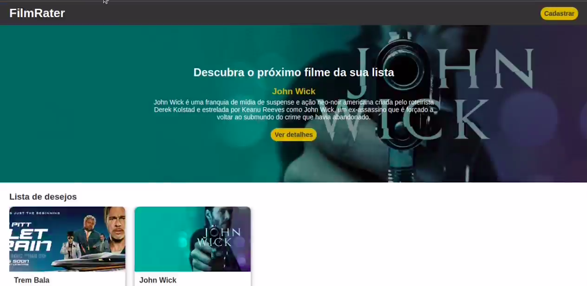

# MovieRegister

Uma aplicação de registro de filmes. Aqui, você pode cadastrar um filme que você assistiu, atribuir uma nota a ele ou adicionar como um filme que deseja assistir.

## Veja você mesmo

### [https://movies-register.vercel.app/](https://movies-register.vercel.app/)

## Sobre o projeto

Esse projeto foi desenvolvido para consolidar o aprendizado dos conceitos de Angular.

## Tecnologias

- Angular
- TypeScript
- CSS
- Ícones Font Awesome

## Como rodar

1. Clone o projeto
2. Instale as dependências com `npm install`
3. Rode `npm start`
4. Acese [http://localhost:4200/](http://localhost:4200/)
